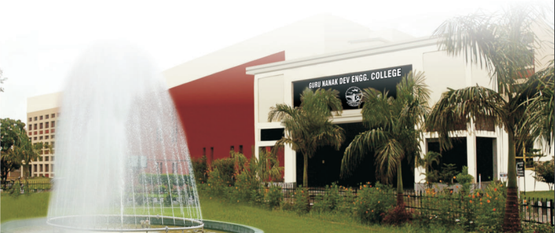

# Department of Civil Engineering
## Guru Nanak Dev Engineering College, Ludhiana

- [About Us](Presentation/About.md)
- [CED Newsletter 2020-21](Presentation/CE/CE.md)
- [Department Website](https://ce.gndec.ac.in/)
- [Faculty](Presentation/Faculty.md)
- [Staff](Presentation/Presentation/Staff.md)
- [Students](Presentation/Students.md)
- [PhD guided](Presentation/PhD.md)
- [Publications](Presentation/Publications.md)
- [Projects](Presentation/Projects.md)
- [Grants](Presentation/Grants.md)
- [Consultancy](Presentation/Consultancy.md)
- [Infrastructure](Presentation/Infrastructure.md)
- [Achievements](Presentation/Achievements.md)

# Guru Nanak Dev Engineering College, Ludhiana
An Autonomous College Under UGC Act 1956
