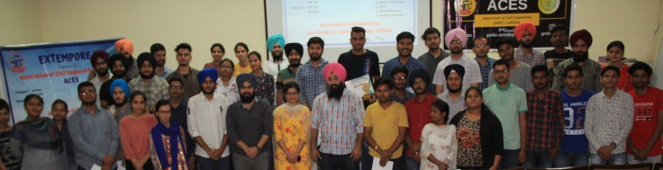

# Association of Civil Engineering Students (ACES)

| [Events Organied](ACES.md) | [Gallery](gallery.md) | [ACES Website](https://gndecaces.wordpress.com/) |

#### Various events conducted in the past year by the students and Coordinator are provided in the following table.

| Sr. No. | Name of Event Organized             | Faculty Coordinator                            | Duration | Date(s)            |
|:--------|:------------------------------------|:-----------------------------------------------|:---------|:-------------------|
| 1.      | Group Discussion                    | Prof. Yuvraj Singh & Prof. Sukhwinderpal Singh | 1 day    | 25 Feb 2020        |
| 2.      | Poster Making Contest               | Prof. Yuvraj Singh & Prof. Sukhwinderpal Singh | 3 day    | 19 - 21 June, 2020 |
| 3.      | Brains Out                          | Prof. Yuvraj Singh & Prof. Sukhwinderpal Singh | 1 day    | 05-Jul-2020        |
| 4.      | Teachers Day                        | Prof. Yuvraj Singh & Prof. Sukhwinderpal Singh | 1 day    | 05-Sep-2020        |
| 5.      | Farewell 404                        | Prof. Yuvraj Singh & Prof. Sukhwinderpal Singh | 1 day    | 06-Sep-2020        |
| 6.      | Engineers Week                      | Prof. Yuvraj Singh & Prof. Sukhwinderpal Singh | 6 Days   | 14 - 20 Sep 2020   |
| 7.      | Squiz your Mind                     | Prof. Yuvraj Singh & Prof. Sukhwinderpal Singh | 2 Days   | 16 - 18 Sep 2020   |
| 8.      | Getting started with Git and Github | Prof. Yuvraj Singh & Prof. Sukhwinderpal Singh | 1 day    | 27 Sep 2020        |
| 9.      | FreeCAD - The designing Contest     | Prof. Yuvraj Singh & Prof. Sukhwinderpal Singh | 5 Days   | 11 - 15 Oct 2020   |
| 10.     | Click-Pic-Diwali                    | Prof. Yuvraj Singh & Prof. Sukhwinderpal Singh | 2 Days   | 14 - 15 Oct 2020   |
| 11.     | Children’s Day                      | Prof. Yuvraj Singh & Prof. Sukhwinderpal Singh | 1 Day    | 14-Nov-2020        |
| 12.     | Kala Purab                          | Prof. Yuvraj Singh & Prof. Sukhwinderpal Singh | 4 Days   | 27 - 30 Nov 2020   |
