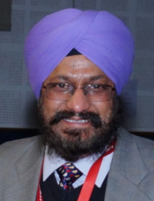

# Department of Civil Engineering  

## Message from HoD's Desk  

It is heartening to note that “Newsletter” is being published on-line, which will be a compilation of all achievements of various departments / sections. The efforts of the Editorial Team is highly appreciable and I wish to put it on record. Congratulations to all members of the Editorial Team for bringing this “Newsletter” in an excellent present form using the latest technologies suitable for such team work.

Our vision is to develop constructive thinking and analytical capabilities of every student.

The Civil Department has all along contributed not only in providing the academic excellence but also in building the basic infrastructure of this great Institute; therefore, there would not be a better time to engage in introspection and put together our achievements as well as our resolve to engage with the challenges in of future in view of rapidly changing needs and environment of our society.

Our department is committed to provide students with a strong, broad based fundamental engineering education, using cutting edge technologies and modern equipment. That coupled with dedicated efforts of staff and faculty results in excellent outcomes, which make our students shine in every nook and corner of this planet.

We also impart entrepreneurial skills in students through summer internships / workshops, so that they would drive the spirit of growth of our economy and would be able to generate employment opportunities for other qualified and skilled people.

I can vogue on behalf of my faculty colleagues and staff that we will continue to strive for greater heights in teaching and research that is relevant and shall help in nation building.

Wishing all our students a brilliant and bright future.

Dr. H S Rai  
HoD, Civil Engineering Department

## Department at Glimpse

####  SDT on "Efficient, Trackable and Sustainable Workflow"

To address the issues associated with poor workflow, and making sure that the computer resources are used efficiently and with the provision to track changes, TEQIP-III sponsored skill development training on "Efficient, Trackable and Sustainable Workflow" was organised by Examination Branch of Guru Nanak Dev Engineering College (GNDEC) in association with Departments of Civil Engineering and Computer Science Engineering from December 02-08, 2020.

***The organising team of SDT during the event***  

This one week training suitable for all professionals commenced from December 02, 2020 onwards on a self-paced mode. The skill development training concluded successfully with a valedictory function. Course Co-ordinator, Dr H S Rai while briefing the proceedings of the training program which focussed on Version Control System (VCS) mentioned the diverse range of participants from the Principal of the institution, faculty members, students to non-teaching staff. In order to deliver the course content effectively and efficiently, an excellent learning platform and content management system called Moodle was used. This platform enabled the participants to learn and attain hands on experience at their own pace. The training program also encouraged peer learning by discussing doubts among participants at the dedicated forum. Furthermore, keeping in view the changing scenario, Dr Rai emphasized on paper-less and thus a sustainable approach towards documentation by using available open-source powerful tools. Adding to this, he also talked about importance of version control of these documents which was the core of this training program.

During the valedictory function, feedback from participants was taken. The participants expressed their joy in learning new skills during the training program. One of the participants, Dr K D Singh said that if implemented, such a version control system can prove to be a revolutionary step for the organisation to address issues related to effective management of documentation. Dr Sehijpal Singh, Principal, GNDEC, while addressing the audience said that efficient workflow is the need of every organisation as poor documentation often leads to mismanagement and wastage of lot of resources. He expressed his views on importance of this much needed course for addressing the said issues. Furthermore, he, as a course participant too, said that the training program was an enjoyble and a great learning experience. He congratulated the organising team for this wonderful effort and dedicated approach during the training program.

## Faculty Achievements  

- **Er. Heena Malhotra** completed her PhD in June, 2020 from PEC, Chandigarh, on  Topic "A Study on Bheaviour of Granular Anchor Pile Foundation Subjected to Uplift Loads"

- BEST PAPER AWARD "Sonia Chutani, **Dr. Jagbir Singh**" (2020). Use of Constriction factor based particle swarm optimization in design of reinforced concrete beams.  Sustainable Development through Engineering Innovations:Proceedings. doi: 10.1007/978-981-15-9554-7

## Publications  

- [**Yuvraj Singh, Harvinder Singh.** (2021) Applications of Fiber Reinforced Polymer Laminates in Strengthening of Structures. In: Ashish D.K., de Brito J., Sharma S.K. (eds) 3rd International Conference on Innovative Technologies for Clean and Sustainable Development. ITCSD 2020. RILEM Bookseries, vol 29. Springer, Cham. https://doi.org/10.1007/978-3-030-51485-3_17](https://link.springer.com/chapter/10.1007/978-3-030-51485-3_17)

- [**Yuvraj Singh**, Sukhwant Singh, **Harvinder Singh**. (2021) Effect of Steel Fibers on the Sorptivity of Concrete. In: Seetharamu S., Jagadish T., Malagi R.R. (eds)Fatigue, Durability, and Fracture Mechanics. Lecture Notes in Mechanical Engineering. Springer, Singapore.https://doi.org/10.1007/978-981-15-4779-9_32](https://link.springer.com/chapter/10.1007/978-981-15-4779-9_32)

- [Prabhpreet Singh,**Inderpreet Kaur** & **Navneet Singh** (2020). A review of different bacteria carriers used in self-healing mechanism. Materials Today: Proceedings. doi:10.1016/j.matpr.2020.05.100](https://www.sciencedirect.com/science/article/pii/S2214785320336567)

- [**Pushpinder Singh**, S.K. Singh (2020). Performance Evaluation for Use of Recycled Concrete Aggregates in Flexible Pavement. Sustainable Development through Engineering Innovations: Proceedings. doi: 10.1007/978-981-15-9554-7](https://www.springer.com/in/book/9789811595530?utm_medium=affiliate&utm_source=commission_junction&utm_campaign=3_nsn6445_brand_PID100011630&utm_content=de_textlink#aboutBook)

- [Vinay Kumar Bhadhwar, **Sukhwinderpal Singh** & **Balihar Singh** (2020). Biotransformation of paper mill sludge and tea waste with cow dung using vermicomposting. Bioresource Technology, 318(), 124097–. doi:10.1016/j.biortech.2020.124097](https://www.sciencedirect.com/science/article/abs/pii/S0960852420313705#:~:text=Vermicomposting%20of%20paper%20mill%20sludge,carried%20out%20using%20Eisenia%20fetida.&text=The%20TN%2C%20TP%20and%20TK,in%20EC%20and%20ash%20Content.)

- [Vinay Kumar Bhadhwar,**Sukhwinderpal Singh**,&**Balihar Singh** (2020) Biotransformation of industrial waste for nutrient rich vermicompost - A review of the bioconversion process by earthworms.Sustainable Development through Engineering Innovations: Proceedings. doi: 10.1007/978-981-](https://www.springer.com/in/book/9789811595530?utm_medium=affiliate&utm_source=commission_junction&utm_campaign=3_nsn6445_brand_PID100011630&utm_content=de_textlink#aboutBook)

- [**Navneet Singh, Ajitpal Singh, Harvinder Singh** (2020). Self Healing of concrete using Bacterial Solution. Sustainable Development through Engineering Innovations: Proceedings. doi: 10.1007/978-981-15-9554-7](https://www.springer.com/in/book/9789811595530?utm_medium=affiliate&utm_source=commission_junction&utm_campaign=3_nsn6445_brand_PID100011630&utm_content=de_textlink#aboutBook)

- [Aakshi, **Gurdeepak Singh, Pardeep Singh** (2020),Soil Stabilization By Using Coconut Shell Ash (CSAP) and Egg Shell Powder (ESP). Sustainable Development through Engineering Innovations: Proceedings. doi: 10.1007/978-981-15-9554-7](https://www.springer.com/in/book/9789811595530?utm_medium=affiliate&utm_source=commission_junction&utm_campaign=3_nsn6445_brand_PID100011630&utm_content=de_textlink#aboutBook)

- [Harwinder Kaur, **Gurdeepak Singh, Amandeep Singh** (2020),BEHAVIOUR OF SKIRTED SQUARE FOOTING RESTING ON SAND BED AND BACKFILLED BY POND ASH. Sustainable Development through Engineering Innovations: Proceedings. doi: 10.1007/978-981-15-9554-7](https://www.springer.com/in/book/9789811595530?utm_medium=affiliate&utm_source=commission_junction&utm_campaign=3_nsn6445_brand_PID100011630&utm_content=de_textlink#aboutBook)

- [Sandeep Kaur, **Prabhjot Singh**(2020). Design and cost analysis for the rehabilitation of a flexible pavement through the study on traffic data. Sustainable Development through Engineering Innovations: Proceedings. doi: 10.1007/978-981-15-9554-7](https://www.springer.com/in/book/9789811595530?utm_medium=affiliate&utm_source=commission_junction&utm_campaign=3_nsn6445_brand_PID100011630&utm_content=de_textlink#aboutBook)

- [**Harvinder Singh**, Sushant Gupta "Orthotropic coefficients and continuity factors for reinforced concrete slabs supported on three sides", International Journal of Engineering: Transaction Basic-A (2021); 34(2), 375-381.](http://www.ije.ir/article_123138.html)

- [**Harvinder Singh** (2020) “Closed-Form Solution for Shear Strength of Steel Fiber Reinforced Concrete Beams”; ACI Structural Journal; 117(3), 261-272.](https://www.concrete.org/publications/internationalconcreteabstractsportal.aspx?m=details&ID=51721373)

- [**Harvinder Singh, Prashant Garg**.(2020)"Modelling the response of piled-raft footing: Utimate Bearing Capacity", Iranian Journal of Science and Technology: Transactions of Civil Engineering ; https://doi.org/10.1007/s40996-020-00529-z.](https://link.springer.com/article/10.1007/s40996-020-00529-z)

- [**Harvinder Singh,** K S Bedi (2020)"Shear Capacity of Self-consolidating concrete beams"; ICE Proceeding of Building and Structures; 173 (3), 175-185](https://www.icevirtuallibrary.com/doi/abs/10.1680/jstbu.16.00178)

- [**Pritpal Kaur**, Krishna (2020).Development of Sustainable Concrete Using Bacteria as Self-Healing Agent.Sustainable Development through Engineering Innovations: Proceedings. doi: 10.1007/978-981-15-9554-7](https://www.springer.com/in/book/9789811595530?utm_medium=affiliate&utm_source=commission_junction&utm_campaign=3_nsn6445_brand_PID100011630&utm_content=de_textlink#aboutBook)

- [Mavjot Kaur, Krishna Murari, **Inderpreet Kaur** (2020) Techniques and various efficiency evaluation tests for self-healing cement-based matrix: State-of-the-art.IOP Conference Series: Materials Science and Engineering, 814(), 012023–. doi:10.1088/1757-899X/814/1/012023 ](https://iopscience.iop.org/article/10.1088/1757-899X/814/1/012023/pdf)

- [Faisal Hussain, **Inderpreet Kaur**, Amir Hussain, Reviewing the influence of GGBFS on concrete properties (2020). Reviewing the influence of GGBFS on concrete properties. Materials Today: Proceedings, S2214785320355206–. doi:10.1016/j.matpr.2020.07.410](https://www.sciencedirect.com/science/article/pii/S2214785320355206#:~:text=Consistency%20and%20setting%20time%20are,70%25%20replacement%20%5B29%5D.)

- [**Inderpreet Kaur Dhindsa, Hardeep Singh Rai, Harvinder Singh** (2020). Development of rectangular hybrid-stiffened-plate structural system with fibre-reinforced polymer fabric composite in tension zone. Advances in Structural Engineering, 136943322094875–. doi:10.1177/1369433220948755 ](https://journals.sagepub.com/doi/abs/10.1177/1369433220948755?journalCode=asea)

- [Dr.Satinder Kaur Khattra, **Dr. Hardeep Singh Rai & Dr. Jagbir Singh** (2020).Generating Structural Model Through Automatic Data Extraction Using OpenBIM Technology.International Journal of Advanced Research in Engineering and Technology (IJARET) Volume 11, Issue 7, July 2020, pp. 602-613, Article ID: IJARET_11_07_060 DOI: 10.34218/IJARET.11.7.2020.060](http://www.iaeme.com/MasterAdmin/Journal_uploads/IJARET/VOLUME_11_ISSUE_8/IJARET_11_08_038.pdf)

- [Sonia Chutani, **Dr. Jagbir Singh** (2020). Use of Constriction factor based particle swarm optimization in design of reinforced concrete beams.(2020)  Sustainable Development through Engineering Innovations: Proceedings. doi: 10.1007/978-981-15-9554-7](https://www.springer.com/in/book/9789811595530?utm_medium=affiliate&utm_source=commission_junction&utm_campaign=3_nsn6445_brand_PID100011630&utm_content=de_textlink#aboutBook)

- [Dr.Satinder Kaur Khattra, **Dr. Hardeep Singh Rai & Dr. Jagbir Singh** (2020) ASSESSMENT OF BUILDING INFORMATIONMODELING FOR STRUCTURAL ANALYSISDOMAIN International Journal of Advanced Research in Engineering and Technology (IJARET) Volume 11, Issue 8, August 2020, pp. 381-392, Article ID: IJARET_11_08_038 DOI: 10.34218/IJARET.11.8.2020.038](https://www.academia.edu/44748023/ASSESSMENT_OF_BUILDING_INFORMATION_MODELING_FOR_STRUCTURAL_ANALYSIS_DOMAIN)

- [Dr.Satinder Kaur Khattra, **Dr. Hardeep Singh Rai & Dr. Jagbir Singh** (2020) Leveraging the Potential of BIM towards Sustainable Construction IOP Conference Series: Materials Science and Engineering, Volume 955, First International Conference on Sustainable Infrastructure with Smart Technology for Energy and Environmental Management (FIC-SISTEEM-2020) 3-4 September 2020, Tamil Nadu, India](https://iopscience.iop.org/article/10.1088/1757-899X/955/1/012011)

- [**Heena Malhotra**, Sanjay Kumar Singh (2020) Study on effect of encasing on pull-out response of granular anchor pile foundation. Arab J Geosci 13, 481  https://doi.org/10.1007/s12517-020-05499-0](https://link.springer.com/article/10.1007/s12517-020-05499-0)

- [**Heena Malhotra**, Sanjay Kumar Singh (2020).Experimental and Numerical Studies on Pull-out Behavior of Granular Anchor Pile Foundation Embedded in Sandy Soil. Arab J Sci Engg.https://doi.org/10.1007/s13369-020-05013-4](https://link.springer.com/article/10.1007/s13369-020-05013-4)

- [**Heena Malhotra**, Sanjay Kumar Singh (2021) Ground Improvement by Granular Anchor Pile Foundation in Cohesive Soil under Axial Pull-Out Loads. Geotechnics for Infrastructure Development & UrbaniSation (GeoINDUS)  https://doi.org/10.1007/978-981-33-6590-2](https://link.springer.com/article/10.1007/s12517-020-05499-0)

- [Harpuneet Singh, **Yuvraj Singh** (2019) Applications of Recycled and Waste Materials in Infrastructure Projects. In: Singh H., Garg P., Kaur I. (eds) Proceedings of the 1st International Conference on Sustainable Waste Management through Design. ICSWMD 2018. Lecture Notes in Civil Engineering, vol 21. Springer, Cham. https://doi.org/10.1007/978-3-030-02707-0_65](https://link.springer.com/chapter/10.1007/978-3-030-02707-0_65)

## Events Organized (FDPs/Conferences/STCs/SDTs/Workshops/Webinars etc.)  

| Sr. No. | Name of Event                                                                     | Faculty Coordinator                                         | Duration | Date(s)                  | Sponsor(s)          |
|:--------|:----------------------------------------------------------------------------------|:------------------------------------------------------------|:---------|:-------------------------|:--------------------|
| 1       | SDT on "Efficient, Trackable and Sustainable Workflow" (Run-1)                    | Dr H S Rai & Er. Yuvraj Singh                               | One Week | 02-08 December, 2020     | TEQIP-III           |
| 2       | SDT on "Efficient, Trackable and Sustainable Workflow" (Run-2)                    | Dr H S Rai & Er. Yuvraj Singh                               | One Week | 30 Dec - 05 Jan, 2020    | TEQIP-III           |
| 3.      | Webinar on "Modes of Teaching and Learning in Lockdown"                           | Er. Lakhveer Singh Khana & Er. Charnjeet Singh              | 2 Hours  | 11 May, 2020             | TEQIP-III           |
| 4.      | International Congress on Sustainable Development through Engineering Innovations | Dr. Harvinder singh, Dr. Puneetpal singh , Dr.Prashant Garg | 3 days   | 17-18-19 September, 2020 | TEQIP-III, Springer |
| 5.      | GENESIS 2020                                                                      | Dr. Jagbir Singh, Dr. Puneetpal Singh Cheema                | 2 days   | 5-6 March 2020           | Coca-Cola India     |

## Events Attended (FDPs/Conferences/STCs/SDTs/Workshops/Webinars etc.)  

| Sr. No. | Name of Faculty     | Name of Event                                                                                                                   | Duration          | Date(s)                         | Organizing Institute                                                                                                                |
|:--------|:--------------------|:--------------------------------------------------------------------------------------------------------------------------------|:------------------|:--------------------------------|:------------------------------------------------------------------------------------------------------------------------------------|
| 1       | Gurpuneet Singh     | Online PDT Programme organised by IIM, Raipur.                                                                                  | 3 days            | October 26-28, 2020             | IIM, Raipur                                                                                                                         |
| 2       | Pushpinder Singh    | Sustainable Development through Engineering Innovations                                                                         | 3 days            | 17 -19 Sep, 2020                | GNDEC Ludhiana                                                                                                                      |
| 3       | Pushpinder Singh    | Sustainable Development through Engineering Innovations                                                                         | 3 days            | 17 -19 Sep. 2020                | GNDEC Ludhiana, Spoken Tutorial Project, IIT Bombay                                                                                 |
| 4       | Pushpinder Singh    | Geosynthetics and Reinforced Soil Structures                                                                                    | 12 week course    | Jan-April 2020                  | NPTEL, IIT Madras                                                                                                                   |
| 5       | Pushpinder Singh    | Global Navigation Satellite Systerms and Applications                                                                           | 4 week course/FDP | Sep-Oct, 2020                   | NPTEL, IIT Roorkee                                                                                                                  |
| 6       | Pushpinder Singh    | Modes of Teaching and Learning in Lockdown                                                                                      | 1 day             | May 11, 2020                    | SWAYAM-NPTEL, GNDEC Ludhiana                                                                                                        |
| 7       | Pushpinder Singh    | IPR and Patent Filing                                                                                                           | 1 day             | July 2, 2020                    | IPR Cell, GNDEC Ludhiana                                                                                                            |
| 8       | Pushpinder Singh    | Indo-China Research Webinar Series in Civil and Environmental Engineering                                                       | 1 week            | May 8-19, 2020                  | Indian Geotechnical Society                                                                                                         |
| 9       | Balihar Singh       | Workshop on E-Learning                                                                                                          | 1 Day             | Jan 24, 2020                    | GNDEC, Ludhiana                                                                                                                     |
| 10      | Balihar Singh       | Training on Future Skills Technologies: Cyber Security                                                                          | 12 Days           | 24 Feb - 6 March 2020           | IIT Roorkee                                                                                                                         |
| 11      | Balihar Singh       | Development Intelligent Water Infrastructure Using Open Flows WaterGEMS Connect Edition                                         | 1 Day             | April 24, 2020                  | Bentley Institute                                                                                                                   |
| 12      | Balihar Singh       | Social Enterpreneurship in the Waste Management Sector                                                                          | 1 Day             | April 25, 2020                  | Green Worms                                                                                                                         |
| 13      | Balihar Singh       | Modes of Teaching and Learning in Lockdown                                                                                      | 1 Day             | May 11, 2020                    | GNDEC, Ludhiana                                                                                                                     |
| 14      | Balihar Singh       | COVID-19: WASH in Vulnerable Communities                                                                                        | 1 Day             | 12 May,2020                     | The International Water Association                                                                                                 |
| 15      | Balihar Singh       | Plastic Waste Management                                                                                                        | 12 Week           | Jan - April 2020                | SWAYAM-NPTEL                                                                                                                        |
| 16      | Balihar Singh       | IPR and Patent Filing                                                                                                           | 1 day             | July 2, 2020                    | IPR Cell, GNDEC Ludhiana                                                                                                            |
| 17      | Balihar Singh       | Sustainable Development through Engineering Innovations                                                                         | 3 Days            | 17 -19 Sep. 2020                | GNDEC, Ludhiana                                                                                                                     |
| 18      | Balihar Singh       | International Webinar on Health Monitoring of Structures through Instrumentation by ICI & Bennett University                    | 1 Day             | July 18, 2020                   | UltraTech Cement Ltd. and ICI                                                                                                       |
| 19      | Balihar Singh       | Municipal Solid Waste Management                                                                                                | 12 Weeks          | Sep. - Dec. 2020                | SWYAM NPTEL                                                                                                                         |
| 20      | Balihar Singh       | Application of Remote Sensing and GIS in Civil Engineering                                                                      | 1 Day             | July 4, 2020                    | NIT Jalandhar                                                                                                                       |
| 21      | Navneet Singh       | Workshop on E-Learning                                                                                                          | 1 Day             | Jan 24, 2020                    | GNDEC, Ludhiana                                                                                                                     |
| 22      | Navneet Singh       | IPR and Patent Filing                                                                                                           | 1 Day             | July 2, 2020                    | IPR Cell, GNDEC Ludhiana                                                                                                            |
| 23      | Navneet Singh       | Use of Micro-Materials in Concrete                                                                                              | 1 Day             | July 4, 2020                    | Qcrete Readymix(India)Pvt Ltd                                                                                                       |
| 24      | Navneet Singh       | Sustainable Development through Engineering Innovations                                                                         | 3 Days            | 17 -19 Sep. 2020                | GNDEC, Ludhiana                                                                                                                     |
| 25      | Navneet Singh       | Maintenance and Repair of Concrete Structures                                                                                   | 12 week course    | Jan-April 2020                  | NPTEL, IIT Madras                                                                                                                   |
| 26      | Navneet Singh       | Global Navigation Satellite Systerms and Applications                                                                           | 04 week course    | 4 week course/FDP               | NPTEL, IIT Roorkee                                                                                                                  |
| 27      | Navneet Singh       | Reinforced Concrete Road Bridges                                                                                                | 04 week course    | 4 week course/FDP               | NPTEL, IIT Kharagpur                                                                                                                |
| 28      | Amandeep Singh      | Open Source Learning Management System: Modular Object-Oriented Dynamic Learning Environment (MOODLE)                           | 5 days            | 16 June - 20 June 2020          | Aligarh Muslim University, Aligarh                                                                                                  |
| 29      | Amandeep Singh      | Funding Schemes for Institution to Support StartUp and Incubation Activities                                                    | 3 days            | 28 Dec. - 30 Dec. 2020          | OpEx Accelerator Pvt. Ltd., Government of India Recognized StartUp Accelerator                                                      |
| 30      | Sukhwinder Singh    | SDT on “Efficient, Trackable and Sustainable Workflow” (Run-2)                                                                  | One Week          | 30 Dec - 05 Jan, 2020           | TEQIP-III                                                                                                                           |
| 31      | Sukhwinder Singh    | “Gateway to Data Science” Using Python                                                                                          | 5 Days            | 10 Aug- 14 Aug 2020             | AGIMUS ACADEMY                                                                                                                      |
| 32      | Sukhwinder Singh    | Design of Reinforced Concrete Structures                                                                                        | 12 Weeks          | Sep-Dec 2020                    | SYWAM NPTEL                                                                                                                         |
| 33      | Sukhwinder Singh    | Sustainable Development through Engineering Innovations                                                                         | 3 Days            | 17 -19 Sep, 2020                | GNDEC, Ludhiana                                                                                                                     |
| 34      | Sukhwinder Singh    | Structural Health Monitoring & Concepts of Concrete Technology                                                                  | 2 Days            | July 23-24, 2020                | Department of Civil Engineering, Jain Institute of Technology, Davangere                                                            |
| 35      | Sukhwinder Singh    | Health Monitoring of Structures through Instrumentation by ICI & Bennett University.                                            | 1 Day             | July 18, 2020                   | ICI in association with Bennett University & UltraTech Cement Limited                                                               |
| 36      | Sukhwinder Singh    | Modes of Teaching and Learning in Lockdown                                                                                      | 1 Day             | May 11, 2020                    | GNDEC, Ludhiana                                                                                                                     |
| 37      | Sukhwinder Singh    | Wraparound Reinforcement Technique for Shallow Foundation                                                                       | 1 Day             | May 19, 2020                    | OEA-DTU.                                                                                                                            |
| 38      | Sukhwinder Singh    | “Green and Permanent Earthing for Safer India”                                                                                  | 1 Day             | May 02, 2020                    | INTER TECH                                                                                                                          |
| 39      | Sukhwinder Singh    | Teaching During Lockdown                                                                                                        | 1 Day             | May 10, 2020                    | GNDEC                                                                                                                               |
| 40      | Manvinder Kingra    | National Webinar on “Technological Innovation and Academia Industry Collaboration under Self-Reliant India                      | 1 day             | June 23, 2020                   | MOHAMED SATHAK A J COLLEGE OF ENGINEERING, Siruseri IT Park, Chennai                                                                |
| 41      | Manvinder Kingra    | IPR and Patent Filing                                                                                                           | 1 Day             | July 02, 2020                   | IPR Cell, GNDEC Ludhiana                                                                                                            |
| 42      | Manvinder Kingra    | “Advancements in Earthquake Engineering”                                                                                        | 1 week            | 6 -10 July, 2020                | RGPV, under TEQIP- III in association with Civil Engineering Department of IPS Academy, Institute of Engineering & Science, Indore. |
| 43      | Manvinder Kingra    | “Crisis and Disaster Management”.                                                                                               | 3 days            | 9- 11 july,2020                 | NIDM, New Delhi                                                                                                                     |
| 44      | Manvinder Kingra    | “ Recent Trends in Civil Engineering”                                                                                           | 1 week            | 6 –11 July,2020                 | Department of Civil Engineering , Balaji Institue of Technology and Science- Narsampet                                              |
| 45      | Manvinder Kingra    | “ECO- ENVIRO-Sustainability”                                                                                                    | 1 week            | 29 June – 03 July, 2020         | RGPV, under TEQIP-III in association with Civil Engineering Department of IPS Academy, Institute of Engineering & Science, Indore.  |
| 46      | Manvinder Kingra    | Special Considerations of Seismic Analysis- Advanced Seismic Analysis in STAAD.Pro CE                                           | one day           | July 09, 2020                   | Bentley Institute                                                                                                                   |
| 47      | Manvinder Kingra    | Basics of Tekla Structures                                                                                                      | one day           | July 03, 2020                   | Department of Civil Engineering, K S Rangasamy College of Technology, Tiruchengode                                                  |
| 48      | Manvinder Kingra    | Application of Remote Sensing and GIS in Civil Engineering                                                                      | one day           | July 04, 2020                   | Dr B R Ambedkar National Institute of Technology Jalandhar                                                                          |
| 49      | Manvinder Kingra    | Research Paper Drafting, Funding & Patent Methodologies                                                                         | 3 days            | July 02 - 04,2020               | Department of Civil Engineering, Dr.N.G.P. Institute of Technology                                                                  |
| 50      | Manvinder Kingra    | Virtual Reality                                                                                                                 | 10 days           | 01 – 10 December, 2020          | Department of Computer Science and Engineering under the Technical Education Quality Improvement Programme (TEQIP)                  |
| 51      | Savleen Takkar      | FDP – Outcome Based Education through Moodle                                                                                    | 14 Days           | December 05-18, 2019            | GNDEC, Ludhiana                                                                                                                     |
| 52      | Savleen Takkar      | Workshop on eLearning                                                                                                           | 1 Day             | January 24, 2020                | GNDEC, Ludhiana                                                                                                                     |
| 53      | Savleen Takkar      | 2- Day Session on Bentley STAAD.Pro CONNECT Edition                                                                             | 2 Days            | May 05-06, 2020                 | Bentley Institute                                                                                                                   |
| 54      | Savleen Takkar      | Modes of Teaching and Learning in Lockdown                                                                                      | 1 Day             | May 11, 2020                    | GNDEC, Ludhiana                                                                                                                     |
| 55      | Savleen Takkar      | FDP – Eco - Enviro - Sustainability                                                                                             | 5 Days            | July 03-29, 2020                | Institute of Engineering and Science –TEQIP - III                                                                                   |
| 56      | Savleen Takkar      | IPR and Patent Filing                                                                                                           | 1 Day             | July 02, 2020                   | IPR Cell, GNDEC Ludhiana                                                                                                            |
| 57      | Savleen Takkar      | Quality in Home Constrcution                                                                                                    | 1 Day             | January 23, 2020                | TATA TISCON                                                                                                                         |
| 58      | Savleen Takkar      | Shotcrete technology for underground construction                                                                               | 1 Day             | June 23, 2020                   | MAPEI India                                                                                                                         |
| 59      | Savleen Takkar      | Sustainable Development through Engineering Innovations                                                                         | 3 Days            | 17 -19 Sep, 2020                | GNDEC, Ludhiana                                                                                                                     |
| 60      | Charanjeet Singh    | Sustainable Development through Engineering Innovations                                                                         | 3 Days            | 17 -19 Sep, 2020                | GNDEC, Ludhiana                                                                                                                     |
| 61      | Charanjeet Singh    | Modes of Teaching and Learning in Lockdown                                                                                      | 1 Day             | May 11, 2020                    | GNDEC, Ludhiana                                                                                                                     |
| 62      | Charanjeet Singh    | Workshop on E-Learning                                                                                                          | 1 Day             | Jan 24, 2020                    | GNDEC, Ludhiana                                                                                                                     |
| 63      | Charanjeet Singh    | Geosynthetics and Reinforced Soil Structures                                                                                    | 12 week course    | Jan-April 2020                  | NPTEL, IIT Madras                                                                                                                   |
| 64      | Charanjeet Singh    | Indo-Canadian Workshop on Interactive Design in Geotechnical Engineering: Theory to Practice                                    | 9 days            | September 24 to October 2, 2020 | “National Institute of Technology Karnataka (NITK), Surathkal,Indian Geotechnical Society (IGS)                                     |
| 65      | Prabhjot Singh      | App of Remote sensing & GIS in CE                                                                                               | 1 day             | July 24, 2020                   | NIT, Jalandhar                                                                                                                      |
| 66      | Prabhjot Singh      | Application of GIS in civil engg.                                                                                               | 1 day             | July 11, 2020                   | Kumaraguru College of technology                                                                                                    |
| 67      | Prabhjot Singh      | Design of RCC structures                                                                                                        | 5 days            | July 7-12, 2020                 | Sandip polytechnic, Nashik                                                                                                          |
| 68      | Prabhjot Singh      | FEM for beginners                                                                                                               | 5 days            | July 20-24, 2020                | Chitkara University                                                                                                                 |
| 69      | Prabhjot Singh      | Guidelines for writing research paper                                                                                           | 1 day             | May 22, 2020                    | Arasu Engg. College, Chennai                                                                                                        |
| 70      | Prabhjot Singh      | Recent advancements in conc technology                                                                                          | 5 days            | Sep 15-19, 2020                 | NIT, Jalandhar                                                                                                                      |
| 71      | Prabhjot Singh      | “ Recent Trends in Civil Engineering”                                                                                           | 1 week            | July 6-11, 2020                 | Department of Civil Engineering , Balaji Institue of Technology and Science- Narsampet                                              |
| 72      | Prabhjot Singh      | Use of Micro-Materials in Concrete                                                                                              | 1 Day             | July 04, 2020                   | Qcrete Readymix(India)Pvt Ltd                                                                                                       |
| 73      | Prabhjot Singh      | SSC, Geopolymer & Fibre reinforced concrete                                                                                     | 1 day             | July 04, 2020                   | Guru Nanak institutions technical campus, Telangana                                                                                 |
| 74      | Prabhjot Singh      | Structural & foundational analysis                                                                                              | 1 week            | 27 April to 3 May, 2020         | Skyfi labs                                                                                                                          |
| 75      | Prabhjot Singh      | Sustainable Development through Engineering Innovations                                                                         | 3 Days            | 17 -19 Sep, 2020                | GNDEC, Ludhiana                                                                                                                     |
| 76      | Mandeep Kaur        | Multivariate Data Analysis                                                                                                      | 2 weeks           | Dec 11- 24, 2019                | GNDEC, Ludhiana                                                                                                                     |
| 77      | Mandeep Kaur        | Modes of Teaching and Learning in Lockdown                                                                                      | 1 Day             | 43962                           | GNDEC, Ludhiana                                                                                                                     |
| 78      | Mandeep Kaur        | Proposed revision of IS 456:2000 Plain and Reinforced Concrete and IS 1343:2012 Prestressed-Concrete Codes                      | 1 day             | May 14, 2020                    | SEFI, India                                                                                                                         |
| 79      | Mandeep Kaur        | Bridge Engineering-Design,Execution, Maintenance and Rehabilitation                                                             | 5 days            | July 13-17, 2020                | Indian Institution of Bridge Engineers                                                                                              |
| 80      | Mandeep Kaur        | Current environmental impacts and sustainable research solutions                                                                | 6 days            | July 21-28, 2020                | SBCE, Alappuzha                                                                                                                     |
| 81      | Mandeep Kaur        | Practical aspects of civil engineering                                                                                          | 1 week            | August 3-8, 2020                | SIT, Virudhunagar                                                                                                                   |
| 82      | Mandeep Kaur        | Seismic design of bridges and structures                                                                                        | 1 day             | August 14,2020                  | Indian Institution of Bridge Engineers                                                                                              |
| 83      | Mandeep Kaur        | Performing experiments on virtual labs                                                                                          | 5 days            | August 10th-August 14th,2020    | Baba Farid College of Engineering and Technology, Bathinda                                                                          |
| 84      | Mandeep Kaur        | Sustainable Development through Engineering Innovations                                                                         | 3 Days            | 17 -19 Sep. 2020                | GNDEC, Ludhiana                                                                                                                     |
| 85      | Mandeep Kaur        | Training and Practice on MATLAB for Engineering Solutions                                                                       | 5 days            | 26-30 November 2020             | NIT, Jalandhar                                                                                                                      |
| 86      | Mandeep Kaur        | Green Technology and Sustainability Engineering                                                                                 | 5 days            | Decemeber 8-12, 2020            | NIT, Raipur                                                                                                                         |
| 87      | Mandeep Kaur        | Advanced Engineering Optimization Techniques                                                                                    | 5 days            | 24-28 December 2020             | NIT, Jalandhar                                                                                                                      |
| 88      | Ajitpal Singh       | Modes of Teaching and Learning in Lockdown                                                                                      | 1 Day             | May 11, 2020                    | GNDEC, Ludhiana                                                                                                                     |
| 89      | Ajitpal Singh       | Advance Concrete Technology                                                                                                     | 12 Weeks          | Sep-Dec 2020                    | SYWAM NPTEL                                                                                                                         |
| 90      | Ajitpal Singh       | Glass in buildings : Design and applications                                                                                    | 12 Weeks          | Sep-Dec 2020                    | SYWAM NPTEL                                                                                                                         |
| 91      | Ajitpal Singh       | “Women Safety, Rights and Gender Equality”                                                                                      | 1 day             | July, 2020                      | GNDEC Ludhiana                                                                                                                      |
| 92      | Ajitpal Singh       | Quality Assurance and Quality Control in Construction                                                                           | 1 day             | Sept.,2020                      | Dr.N.G.P. IT, Coimbatore                                                                                                            |
| 93      | Ajitpal Singh       | Use of Micro-Materials in Concrete                                                                                              | 1 Day             | July 04, 2020                   | Qcrete Readymix(India)Pvt Ltd                                                                                                       |
| 94      | Pardeep Singh Joia  | Workshop on E-Learning                                                                                                          | 1 Day             | Jan 24, 2020                    | GNDEC, Ludhiana                                                                                                                     |
| 95      | Pardeep Singh Joia  | IPR and Patent Filing                                                                                                           | 1 Day             | July 02, 2020                   | IPR Cell, GNDEC Ludhiana                                                                                                            |
| 96      | Pardeep Singh Joia  | Moodle learning management system                                                                                               | 5 days            | April 27 -1 May 2020            | IIT Bombay                                                                                                                          |
| 97      | Avneet Kaur         | E-Learning (MOOC workshop)                                                                                                      | 1-day             | Jan 24, 2020                    | GNDEC, Ludhiana                                                                                                                     |
| 98      | Avneet Kaur         | Modes of Teaching and Learning in Lockdown                                                                                      | 1 Day             | May 11, 2020                    | GNDEC, Ludhiana                                                                                                                     |
| 99      | Avneet Kaur         | Empowering effective scientific research by harnessing the powers of ‘Web of Science’ and managing references using ‘End Note’. | 1-day             | 20th May, 2020                  | GNDU, Amritsar                                                                                                                      |
| 100     | Avneet Kaur         | Panal Discussion- Present Pandemic & revival of environment                                                                     | 1-day             | 17th May, 2020                  | GNDEC, Ludhiana                                                                                                                     |
| 101     | Avneet Kaur         | Green Cities                                                                                                                    | 1 Day             | 25th May, 2020                  | Indian Green Building Council                                                                                                       |
| 102     | Avneet Kaur         | FDP on Pavement Design, construction & Rehabilitation                                                                           | 3-days            | 25h to 27th June, 2020          | Vignana bharathi institute of technology                                                                                            |
| 103     | Avneet Kaur         | FDP on Eco-Enviro-Sustainability                                                                                                | 5-days            | 29th June to 3rd July, 2020     | IPS Academy institute of engineering & Science                                                                                      |
| 104     | Avneet Kaur         | IPR and Patent Filing                                                                                                           | 1 Day             | July 02, 2020                   | IPR Cell, GNDEC Ludhiana                                                                                                            |
| 105     | Avneet Kaur         | FDP on Recent Trends in Civil Engineering                                                                                       | 6-days            | 6th to 11th July, 2020          | Balaji Institute of technology                                                                                                      |
| 106     | Avneet Kaur         | FDP on Performing Experiments on Virtual labs                                                                                   | 5-days            | 10th to 14th Aug,2020           | Baba Farid college of engineering                                                                                                   |
| 107     | Avneet Kaur         | Sustainable Development through Engineering Innovations                                                                         | 3 Days            | 17 -19 Sep. 2020                | GNDEC, Ludhiana                                                                                                                     |
| 108     | Avneet Kaur         | Green Technology & Sustainability Engineering                                                                                   | 5-days            | 8th -12th Dec, 2020             | (ATAL) National Institute of Technology Raipur.                                                                                     |
| 109     | Avneet Kaur         | “STC on Advanced Engineering Optimization Techniques”                                                                           | 5-days            | 24th - 28th Dec, 2020           | (TEQIP-III Sponsored) Dr B R AMBEDKAR NATIONAL INSTITUTE OF TECHNOLOGY JALANDHAR, PUNJAB, INDIA                                     |
| 110     | Sukhwinderpal Singh | Natural Attenuation of Groundwater Contaminants: New Paradigms, Technologies and Applications                                   | 9 weeks           | April-June 2020                 | RICE University, USA (Coursera)                                                                                                     |
| 111     | Sukhwinderpal Singh | Modes of Teaching and Learning in Lockdown                                                                                      | 1 Day             | May 11, 2020                    | GNDEC, Ludhiana                                                                                                                     |
| 112     | Sukhwinderpal Singh | Best Practices in Ion Chromatography                                                                                            | 1 Day             | Seo 16, 2020                    | Separation Science, UK                                                                                                              |
| 113     | Sukhwinderpal Singh | Electronic Waste Management- Issues and Challenges                                                                              | 4 weeks           | Jan- Feb, 2020                  | NPTEL, IIT Kharagpur                                                                                                                |
| 114     | Sukhwinderpal Singh | From Climate Science to Action                                                                                                  | 4 weeks           | Oct- Nov, 2020                  | The World Bank Group                                                                                                                |
| 115     | Dr.Jagbir Singh     | An Insight into Revised Accrediction Framework of NAAC                                                                          | 1 day             | Feb 12, 2020                    | J.C. Bose University of Science And Technology, YMCA Faridabad                                                                      |
| 116     | Dr.Jagbir Singh     | Professional Development Training under TEQIP III                                                                               | 3 days            | Oct 26-28, 2020                 | Indian Institute of Managment Tiruchiraappalli                                                                                      |
| 117     | Dr.Jagbir Singh     | Safety Managment in Construction TEQIP III                                                                                      | 5 days            | March 9-13, 2020                | Indian Institue of Technology Delhi.                                                                                                |
| 118     | Dr.Jagbir Singh     | Digital Transformation of Institutions of Higher Learning                                                                       | 5 days            | Dec 1-5, 2020                   | National Academy of Human Resource Debvelopment                                                                                     |
| 119     | Dr.Jagbir Singh     | Sustainable Development through Engineering Innovations                                                                         | 3 Days            | 17 -19 Sep. 2020                | GNDEC, Ludhiana                                                                                                                     |
| 120     | Dr. Inderpreet Kaur | Multivariate Data Analysis                                                                                                      | 2 weeks           | Dec 11-24, 2019                 | GNDEC, Ludhiana                                                                                                                     |
| 121     | Dr. Inderpreet Kaur | IPR and Patent Filing                                                                                                           | 1 Day             | July 02, 2020                   | IPR Cell, GNDEC Ludhiana                                                                                                            |
| 122     | Dr. Inderpreet Kaur | Artificial Intelligence and Machine Learning                                                                                    | 2 weeks           | 7th – 17th December 2020        | IIT, Indore                                                                                                                         |
| 123     | Heena Malhotra      | Indo-Canadian Workshop on Interactive Design in Geotechnical Engineering: Theory to Practice                                    | 9 days            | 24 Sep - 2 Oct, 2020            | NITK Surathkal, IIT Kanpur, University of Ottawa, Canada                                                                            |
| 124     | Heena Malhotra      | Modelling and Analysis of Geotechnical Problems using GTSNX and Soilworks Softwares                                             | 5 days            | 05 Oct-9 Oct 2020               | NITTTR Chandigarh                                                                                                                   |
| 125     | Heena Malhotra      | Rural Construction Technologies                                                                                                 | 5 days            | 31 Aug-04 Sep 2020              | NITTTR Chandigarh                                                                                                                   |
| 126     | Heena Malhotra      | Managerial Skills for Technical Teachers & Administrators                                                                       | 5 days            | 14 Sep-18 Sep 2020              | NITTTR Chandigarh                                                                                                                   |

## [Association of Civil Engineering Students](ACES.md)

